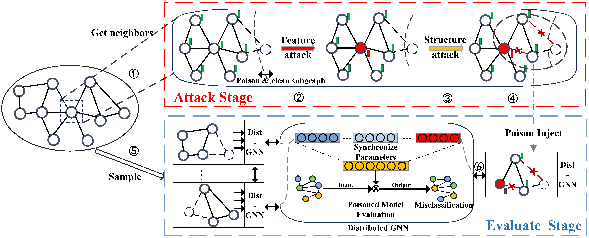

# Disttack: Graph Adversarial Attacks Toward Distributed GNN Training 
An open-sourced repository for **Disttack**

This repo contains comprehensive [Introduction](#Introduction) of **Disttack**, the first adversarial attack framework tailored for distributed GNN training together with the official [implementation](#implementation) of Disttack </b>.


## Introduction
Adversarial attack in graph domains involves the graph's structure and feature perturbations. Communication complexity among multiple computing nodes amplifies security challenges in distributed scenarios. This is the first work thar bridges adversarial attack and distributed GNN training, filling the blank in the related realm.




## Requirements
* `Python 3.9`
* `cuda 11.7 with driver accordingly`
* `DGL`
* `numpy 1.20.3 or higher`
* `matplotlib 3.7.2` 
* `pytorch 1.1.4`

## Platforms
| Platform | Configuration |
| ---------- |---------- |
| CPU | 32-core Intel Xeon Platinum 8350C CPU (2.60GHz) |
| GPU | NVIDIA A100 SXM 80GB |

## Datasets
Except datasets mentioned in our work, any other datasets that can be converted to pytorch graph strcure can be easily adopted. They are available on  https://drive.google.com/drive/folders/1ycwDpOUHTeS1BRxCF9JYAV_KT73t9iHW. For more detile please check README in ```dataset``` folder.
* `Flickr`
* `Arxiv`
* `RedditSV`
* `Reddit`
------------------------------
* `other torch.geometric datasets are supported`

## Implementation
Please use the following steps to execute Disttack.
```
python Disttack/code/main_disttack.py
```
For baselines we used in our work, you can execute them use the following steps:
```
python Disttack/baselines/python test_dice.py #for example
```

## TODO-List
As a framework for adversarial toward distributed GNN training, Disttack is still very preliminary and incomplete. Next improvement directions include:
* `1. Introducing a defense/attack detection mechanism - We believe this will help distributed GNN training to defend against most gradient-based attacks, which is also the current mainstream attack method.`
* `2. Add experimental analysis for the general distributed GNN training framework: In this version of the work, we only considered the mainstream method of Mini-batch training, and did not consider the impact of Distack on the general training framework, resulting in insufficient work.`
* `3. Expand to heterogeneous graphs: Heterogeneous graphs are more relevant to real-life applications than isomorphic graphs, and have greater challenges and opportunities.`
